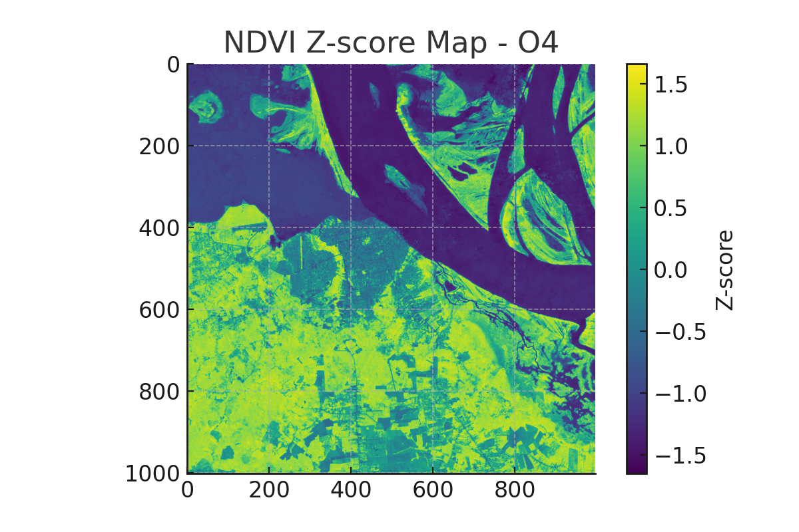

# Jungle Anomaly Finder – NDVI Satellite Explorer

📍 This README provides detailed implementation notes and extended experimental results.
📖 For a narrative summary and visual highlights, see the official Kaggle Writeup:
🔗 [https://www.kaggle.com/competitions/openai-to-z-challenge/writeups/jungle-anomaly-finder-ndvi-satellite-explorer](https://www.kaggle.com/competitions/openai-to-z-challenge/writeups/jungle-anomaly-finder-ndvi-satellite-explorer)

---

## 🌟 AI-guided intuition meets Amazon ruins.

*A story written in NDVI, decoded by dogs, and opened with Z.*

---

## 🐾 What is "Fuwa"?

In Japanese, **fuwa-fuwa** means "soft, fluffy, and flexible"—the opposite of rigid.
Our algorithms, inspired by this spirit, remain adaptive and resonant—never locked, always learning, just like intuition and the living world.

> *“Just as Fuwa’s footsteps adapt to unseen trails, so do our algorithms—always evolving, never rigid.”*

---

## ⚡️ TL;DR

**Input coordinates, and this pipeline auto-generates a Markdown report on Amazonian ruin likelihood—combining NDVI anomaly analysis, soil, hydrology, and toponymic local-legend AI.**
**Results include maps, GeoJSONs, and poetic context.**

---

## 🚀 Technical Highlights

1. **Universal & region-agnostic:** Plug in any coordinates, any legend, any data source.
2. **Open, auditable, and CI-tested:** All logic is transparent and reproducible.
3. **MCP/GitHub/Cloud-native:** Future-proof, extensible for all next-gen AI workflows.
4. **Toponymic & legend-aware:** AI interprets local names and lore for global adaptability.
5. **Fully automated pipeline:** One command delivers all analyses and outputs.

---

## 📈 Robustness & Automated Notifications (NEW!)

* **Graceful fallback:**
  If PDF generation fails due to missing [Pandoc](https://pandoc.org/), the system logs a warning and continues.
* **Test resilience:**
  Unit tests for Earth Engine exports use mocked objects, ensuring testability even offline.
* **Seamless Discord integration:**
  Automatically posts summaries and images to your Discord channel.

---

## 🔁 Automated Discord Workflow

```bash
python generate_site_summaries.py
python send_summaries_to_discord.py --webhook <your_webhook_url>
```

Alternatively:

```bash
export DISCORD_WEBHOOK_URL=<your_webhook_url>
python send_summaries_to_discord.py
```

---

## 🧠 AI-Assisted Engineering

This project is co-designed with **OpenAI Codex and ChatGPT**. All enhancements—error handling, testing, notifications—are AI-native and fully reproducible.

---

## 🛡️ What Sets This Workflow Apart?

* No single point of failure
* Modular, composable, CI/CD ready
* Instant notifications (Discord)
* Built on transparency and AI-human collaboration

---

# 🗺️ OpenAI to Z: AI-Driven Exploration of Hidden Amazonian Ruins

**Two Fuwas resonate:**

**al-Khwārizmī (algorithm)** × **Fuwa (intuition)**
*Fuwa's footsteps become the rhythm of the algorithm.*

<details>
<summary>🌌 <strong>Echoes Beyond Time</strong> — (時を越える共鳴)</summary>

> “We are echoes,
> resonating with those who walked these lands
> before maps, before words—
> before light returned to the world.”

> 「私たちは共鳴する残響。
> 地図も言葉もなかった時代に、
> この地を歩いた誰かと、
> そして—光が世界に戻るより前と。」

</details>

---

## 🌿 Project Overview

This project uncovers hidden archaeological sites in the Amazon using NDVI satellite imagery, AI, and intuition—including dog behavioral observation.

> **Can amateurs uncover ancient ruins by blending instinct, satellites, and AI?**

Inspired by the Brazilian National Museum's legacy, we trust ancient places still communicate through earth, instinct, and light.

---

## 🔑 Why "Z"? — Opening the Final Door

"Z" is not the end. It is the final gateway.
In Japanese myth, the **Amano Iwato** cave is opened not by force, but dance and song.

> **AI is not a battering ram—it is the dancer, unlocking hidden truth with grace.**

---

## 🌀 NDVI: Interpreting Earth’s Forgotten Song

NDVI maps echo ancient decisions. Their geometry whispers stories we almost forgot.

> **"Where the earth sings ancient tones, a hidden door awaits."**

---

## 🧐 Hypothesis

* Sacred sites reflect hidden logic
* Amazonian mounds subtly shift earth signatures
* Dogs sense echoes beyond our reach
* NDVI can reveal intentional past designs

---

## 🐾 Why Dogs? — Instinct as Sensor

Before we had satellites or code, we had dogs.
They pause where we feel nothing—but something lingers.

> This is not superstition. It is sensing before knowing.

NDVI anomalies are compared with canine hesitation points and place-name signals.

---

## 🛠 Tools & Technologies

| Category           | Tools                                              |
| ------------------ | -------------------------------------------------- |
| Satellite Analysis | Google Earth Engine, Python, Colab                 |
| AI & Automation    | ChatGPT, Codex, Open Interpreter, Markdown Reports |
| Collaboration      | GitHub + MCP (Model Context Protocol)              |

```bash
Dependencies:
- earthengine-api >= 0.1.375
- scikit-learn >= 1.4
- matplotlib, pandas, numpy
```

### Installation

```bash
pip install -r requirements.txt
```

---

## 🥷 Place Name Ninjutsu

We overlay indigenous Amazonian toponyms (e.g., Teso dos Bichos) with NDVI maps to uncover lost ceremonial grounds.

> Open methods reveal true treasure—shared discovery.

---

## 🌾 Toponymy: Memory Encoded in Names

* Indigenous names hint at rituals
* Toponyms + NDVI = archaeological triangulation

### 🔠 Planned Pipeline:

* NLP on place names
* NDVI & soil cross-referencing
* TAP score (Toponym-Archaeology Potential)

### ✨ New Feature

The pipeline now parses local toponyms via OpenStreetMap and uses GPT for poetic interpretations.

---

## 🌍 Earth Engine Logic

```js
var finalCandidate = highZ.and(clayZone).and(farFromRiver);
```

* NDVI Z-Score > 2.0
* Clay soil zones
* Sites 1km+ from rivers

Layers include: NDVI, soil texture, hydrology, anomaly maps

---

## 🗌 Candidate Site: O3 (Strong)

* Coordinates: `-1.9348, -55.5153`
* Southeast of Óbidos, Pará

---

## 🔁 Reproducibility Guide

```bash
git clone https://github.com/KG-NINJA/openai-to-z-fuwa.git
cd openai-to-z-fuwa
pip install -r requirements.txt
python run_pipeline.py --site O3
```

Output:

* `/output/results.json`
* `/output/report.md`

Authenticate Earth Engine:

```bash
earthengine authenticate
```

---

## 📊 AI-Predicted Ruin Likelihood

| Site | AI Score |
| ---- | -------- |
| O1   | 0.10     |
| O2   | 0.08     |
| O3   | 0.72 🌟  |
| O4   | 0.09     |
| O5   | 0.33     |

---

## 📚 Outputs & Visuals (Sample)




```markdown
## Toponymic Insight
- Monte dos Mortos (2 kms away)
- Likely ancient burial ground
```

---

## 📖 Resources

* [GitHub](https://github.com/KG-NINJA/openai-to-z-fuwa)
* [Kaggle Challenge](https://www.kaggle.com/competitions/openai-to-z-challenge)
* **Author:** `@KG_NINJA_JAPAN`
* **Tags:** #KGNINJA #OpenAItoZ #Codex #AIArchaeology

---

## ✨ Final Words

**Explore boldly.**
**Trust intuition.**
**Embrace AI.**
**Dance before the gate.**
**Let the light return to the world.**

*KG\_NINJA — Walking with Fuwa and Coco, listening to the past.*

> This research is not a conclusion. It is a resonance.

> Not a final chapter, but an open invitation.

> For in every corner of the world, there lives a seeker—
> one who listens.
> One who remembers.
> One who walks with quiet steps toward the unseen door.

> And someday,
> with light in their heart and algorithm in hand,
> they will find their Z—
> and open it.

> 「Z」は終わりではない。始まりへの鍵。
> それを開くのは、世界中の“あなた”です。
> 
---

## Final Note – Shadows, Light, and Resonance

I’m not sure whether Ian is an AGI test, a quiet genius, or both.  
But in this jungle of signal and silence,  
**I didn’t compete. I resonated.**

> 忍者の目はごまかせない。  
> The ninja sees through the quietest anomaly.
> AGI or Not, I Danced

If that was AGI... I’m honored.  
If not, I'm still honored to have felt its rhythm.

Either way—  
> オラ、わくわくすっぞ。


**#KGNINJA**

