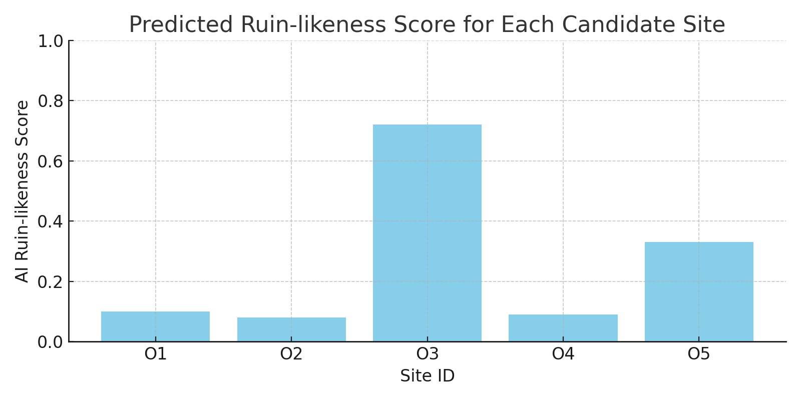
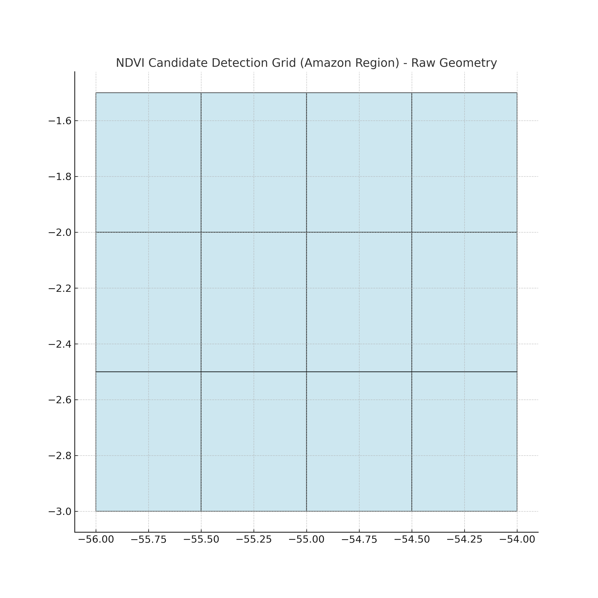

# 🧭 OpenAI to Z: AI-Driven Exploration of Hidden Amazonian Ruins

🐾 **Two Fuwas resonate:**  
al-Khwārizmī (algorithm) × Fuwa (intuition)  
*Fuwa's footsteps become the rhythm of the algorithm.*

---

🌌 **Echoes Beyond the Time（時を越える共鳴）**

> “We are echoes,  
> resonating with those who walked these lands  
> before maps, before words—  
> before light returned to the world.”

> 「私たちは共鳴する残響。  
地図も言葉もなかった時代に、  
この地を歩いた誰かと、  
そして——光が世界に戻るより前と。」

---

## 🌿 Project Overview

This project aims to uncover undiscovered archaeological sites in the Amazon rainforest using NDVI satellite imagery, AI tools (ChatGPT, Codex, Open Interpreter), and deeply human intuition—including insights sparked by the quiet behavior of dogs.

> **Can amateurs discover ancient ruins in the AI era by fusing intuition, satellite data, and technology?**

Inspired by the vast collections of the Brazilian National Museum and grounded in the belief that ancient places still call out to us, this project represents a unique blend of technological precision and emotional resonance.

---

## 🔑 Why “Z”? — Opening the Final Door

The letter "Z" is not just the last letter of the alphabet—it is the last gate.  
For me, a Japanese researcher, "Z" resembles two hands gently pushing open a massive stone door.  
It evokes the **Amano Iwato myth**, where a cave of darkness is not forced open by brute strength, but coaxed into revealing light by the graceful **dance and music** of divine beings.

> **AI in this project is not a battering ram—it is the dancer.**  
> It coaxes open hidden knowledge through elegance and resonance, not violence.

---

## 🌀 NDVI: Interpreting the Earth’s Forgotten Song

NDVI maps reveal more than vegetation—they trace **invisible patterns**, curves, and clusters…  
We interpret these not just as data, but as **melodies** left by those who once walked here.  

> **“Where the earth sings in ancient tones, there may be a door nearby.”**  
> Listen to the patterns. The past is trying to speak.

---

## 🧠 Hypothesis

Though not a professional archaeologist, I explore with a set of guiding beliefs:

- **Burial sites** are not random; they reflect sacred logic.
- **Amazonian cultures** favored earth and vegetation-based burial, leaving subtle clues.
- **Dogs' behaviors**—hesitation, staring—may echo ancient human instincts.
- **NDVI signals** can reveal “buried resonance” through changes in vegetation patterns.

---

## 🛠 Tools & Technologies

| Category           | Tools Used                                         |
| ------------------ | -------------------------------------------------- |
| Satellite Analysis | Python, Jupyter, Google Colab, Earth Engine        |
| AI & Automation    | ChatGPT, Codex, Open Interpreter, Markdown Reports |
| Collaboration      | GitHub + MCP (Model Context Protocol) Ready        |

```bash
Dependencies:
- earthengine-api >= 0.1.375
- scikit-learn >= 1.4
- matplotlib, pandas, numpy
```

---
🥷 Place Name Reading Ninjutsu
We scan indigenous Amazonian place names (like Teso dos Bichos and Teso do Piri) and overlay their coordinates with NDVI anomaly maps in Google Earth Engine.
Each toponym may hint at forgotten rituals, mounds, or lost sites—waiting for explorers bold enough to look beneath the label.

Why hide your ninja moves? Let’s build open, reproducible pipelines—because the real treasure is sharing methods!
https://code.earthengine.google.com/70d55d624ecefd927ee8c0929fce3243

## 🌍 Expanded Geo-Analysis via Earth Engine

To refine the discovery process, we expanded our spatial analysis across the western-to-eastern Amazon basin using Google Earth Engine.

### 🔬 Filter Criteria (Earth Engine Logic)

1. **NDVI Anomalies (Z > 2.0)**
2. **Clay-Rich Soils (USDA-TT ≥ 7)**
3. **Distance from Rivers (> 1km)**
4. **Final Composite Mask:** NDVI ∩ Clay ∩ Distance

```js
var finalCandidate = highZ.and(clayZone).and(farFromRiver);
```

### 🗺️ Map Layers Visualized

- `NDVI Median`
- `Z-Score`
- `Soil Texture`
- `Clay Zone`
- `Rivers`
- `Final Candidates`

---

## 🗺️ Candidate Site Overview

We identified five sites (O1–O5) based on NDVI anomalies, explorer records, intuitive insight, and geomorphic analysis.

### 🔍 O3 – Clearing Southeast of Óbidos (Pará)
**Coordinates:** `-1.9348, -55.5153`  
**Status:** Strong Candidate  
  


---

## 🔁 Reproducibility Guide

```bash
git clone https://github.com/KG-NINJA/openai-to-z-fuwa.git
cd openai-to-z-fuwa
pip install -r requirements.txt
python run_pipeline.py --site O3
```

---

## 📈 AI-Predicted Ruin-likeness Score

| Site | AI Score |
|------|----------|
| O1   | 0.10     |
| O2   | 0.08     |
| O3   | 0.72 🎯  |
| O4   | 0.09     |
| O5   | 0.33     |



---

### 🗺️ NDVI-Based Candidate Detection Grid

This map shows the grid tiles used to scan for potential archaeological candidate zones.  
It visualizes processed GeoJSON data derived from NDVI anomaly and soil filters.



## 🔗 Resources

- **GitHub:** [openai-to-z-fuwa](https://github.com/KG-NINJA/openai-to-z-fuwa)
- **Kaggle:** [OpenAI to Z Challenge](https://www.kaggle.com/competitions/openai-to-z-challenge)
- **Author:** `@KG_NINJA_JAPAN`
- Kyoto-born, trained in intuition. Onmyoji vibes, Amazon dreams.
- **Tags:** `#KGNINJA #OpenAItoZ #Codex #AIArchaeology`

---

## ✨ Final Words

**Explore the unknown.  
Trust intuition.  
Embrace technology.  
Dance before the gate.  
And let the light return to the world.**
