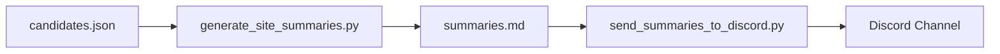

🐾 What is "Fuwa"?
In Japanese, fuwa-fuwa means "soft, fluffy, and flexible"—the opposite of rigid.
Our algorithms, inspired by this spirit, remain adaptive and resonant—never locked, always learning, just like intuition and the living world.

“Just as Fuwa’s footsteps adapt to unseen trails, so do our algorithms—always evolving, never rigid.”

## ⚡️ TL;DR

**Input coordinates, and this pipeline auto-generates a Markdown report on Amazonian ruin likelihood—combining NDVI anomaly analysis, soil, hydrology, and toponymic local-legend AI.  
Results include maps, GeoJSONs, and poetic context.**

## 🚀 Technical Highlights

1. **Universal & region-agnostic:** Plug in any coordinates, any legend, any data source.
2. **Open, auditable, and CI-tested:** All logic is transparent and reproducible.
3. **MCP/GitHub/Cloud-native:** Future-proof, extensible for all next-gen AI workflows.
4. **Toponymic & legend-aware:** AI interprets local names and lore for global adaptability.
5. **Fully automated pipeline:** One command delivers all analyses and outputs.

...
## 📈 Robustness & Automated Notifications (NEW!)

**New in this release:**

- **Graceful fallback:**  
  If PDF generation fails due to missing [Pandoc](https://pandoc.org/), the system logs a warning and continues, never blocking the core workflow.
- **Test resilience:**  
  Unit tests for Earth Engine exports use mocked objects, ensuring all tests run even in restricted or offline environments.
- **Seamless Discord notifications:**  
  All site summaries and evidence images are automatically posted to your chosen Discord channel using `send_summaries_to_discord.py`. The webhook URL can be passed as a CLI argument or via the `DISCORD_WEBHOOK_URL` environment variable.


### ⚡️ Pipeline Overview


- **No single point of failure:**  
  Network issues or missing dependencies never halt the process.  
  Logs provide full traceability for skipped steps.

---

## 🔄 How to Use Automated Discord Notifications

1. **Generate summaries as usual:**
   ```bash
   python generate_site_summaries.py
   ```
2. **Send results to Discord:**
   ```bash
   python send_summaries_to_discord.py --webhook <your_discord_webhook_url>
   ```
   Or, set the webhook as an environment variable:
   ```bash
   export DISCORD_WEBHOOK_URL=<your_discord_webhook_url>
   python send_summaries_to_discord.py
   ```

---

## 🧠 Codex/AI-Assisted Engineering

Recent improvements—including robust error handling, mock-based testing, and the Discord integration—were **co-designed and code-reviewed with OpenAI Codex/ChatGPT**.  
This project demonstrates an AI-native engineering workflow: every automation and enhancement is reproducible, explainable, and open to review.

---

## 🛡️ What Sets This Workflow Apart?

- **No single point of failure:** Every step has a graceful fallback.
- **Modular, composable, and easy to extend (CI/CD ready).**
- **Instant team notifications via Discord—no manual copy-paste.**
- **Designed for reliability, reproducibility, and transparent AI collaboration.**
  
---

# 🗺️ OpenAI to Z: AI-Driven Exploration of Hidden Amazonian Ruins

🐾 **Two Fuwas resonate:**
**al-Khwārizmī (algorithm)** × **Fuwa (intuition)**
*Fuwa's footsteps become the rhythm of the algorithm.*
---
<details>
<summary>🌌 <strong>Echoes Beyond Time（時を越える共鳴）</strong></summary>

> “We are echoes,
> resonating with those who walked these lands
> before maps, before words—
> before light returned to the world.”

> 「私たちは共鳴する残響。
> 地図も言葉もなかった時代に、
> この地を歩いた誰かと、
> そして—光が世界に戻るより前と。」

</details>

---

## 🌿 Project Overview

This project seeks to uncover hidden archaeological sites in the Amazon rainforest by fusing NDVI satellite imagery, AI technology (ChatGPT, Codex, Open Interpreter), and intuitive insights—including observations inspired by canine behavior.

> **Can amateurs uncover ancient ruins by blending intuition, satellite data, and AI?**

Inspired by the Brazilian National Museum's collections, this project uniquely blends technology with emotional resonance, trusting ancient places still communicate to us today.

---

## 🔑 Why “Z”? — Opening the Final Door

"Z" symbolizes not merely the end, but the final gateway. As a Japanese researcher, I see it as two hands gently pushing open a massive stone door. This imagery reflects the **Amano Iwato myth**, in which darkness yields to gentle dance and music, not brute force.

> **AI is not a battering ram—it is the dancer, gracefully unlocking hidden knowledge.**

---

## 🌀 NDVI: Interpreting Earth’s Forgotten Song

NDVI maps reveal subtle patterns—**melodies** left behind by past civilizations.

> **“Where the earth sings ancient tones, a hidden door awaits.”**

---

## 🧐 Hypothesis

I explore guided by these intuitive beliefs:

* Burial sites reflect sacred logic.
* Amazonian burial rituals favored subtle earth disturbances.
* Dogs' behaviors may echo ancient instincts.
* NDVI anomalies may reveal buried archaeological signatures.

---

## 🛠 Tools & Technologies

| Category           | Tools                                                |
| ------------------ | ---------------------------------------------------- |
| Satellite Analysis | Python, Jupyter, Google Colab, Google Earth Engine   |
| AI & Automation    | ChatGPT, Codex, Open Interpreter, Markdown Reporting |
| Collaboration      | GitHub + MCP (Model Context Protocol)                |

```bash
Dependencies:
- earthengine-api >= 0.1.375
- scikit-learn >= 1.4
- matplotlib, pandas, numpy
```

### 📦 Installation

Install the required packages:

```bash
pip install -r requirements.txt
```


---

## 🥷 Place Name Ninjutsu

We analyze indigenous Amazonian toponyms (e.g., Teso dos Bichos, Teso do Piri), overlaying them on NDVI anomaly maps to uncover potential ceremonial sites.

> Open methods reveal true treasure—shared discovery.

[View Earth Engine Script](https://code.earthengine.google.com/70d55d624ecefd927ee8c0929fce3243)

### 🌾 Toponyms: Living Memory & Hidden Knowledge

Amazonian place names often hold encoded geographical and cultural knowledge:

* Indigenous names may hint at lost rituals or sacred sites.
* Overlaying these toponyms with NDVI anomalies could identify archaeological zones invisible even to local communities.

---

### 🔠 Toponym Analysis Pipeline (Planned)

A future pipeline will integrate:

* Indigenous oral histories and mapping
* NLP analysis of recurring spatial terms
* NDVI, soil, and hydrological cross-referencing
* Archaeological potential scoring (TAP score)

### 🌟 New: Automated Toponym & Legend Insights

The pipeline now queries OpenStreetMap within a ~10 km radius for place names
hinting at ruins. These toponyms are summarized and sent to GPT for a short
poetic interpretation in the final Markdown report.

---

## 🌍 Geo-Analysis with Earth Engine

Spatial analyses utilize Google Earth Engine:

### 🔬 Earth Engine Filtering Logic

1. **NDVI Anomalies (Z > 2.0)**
2. **Clay-rich soils (USDA-TT ≥ 7)**
3. **Distance from rivers (>1 km)**

```js
var finalCandidate = highZ.and(clayZone).and(farFromRiver);
```

### 🗘️ Map Layers

* NDVI Median, Z-Score
* Soil Texture, Clay Zone
* Rivers, Final Candidates

---

## 🗌 Candidate Site Overview

We identified five key sites (O1–O5):

### 🔍 O3 – Southeast of Óbidos (Pará)

* Coordinates: `-1.9348, -55.5153`
* **Status:** Strong Candidate

---

## 🔁 Reproducibility Guide

```bash
git clone https://github.com/KG-NINJA/openai-to-z-fuwa.git
cd openai-to-z-fuwa
pip install -r requirements.txt
# Run analysis for a specific site
python run_pipeline.py --site O3
# Consolidated results saved to outputs/results.json
```

### Earth Engine Authentication

Before using scripts that access Google Earth Engine, authenticate with your
user account:

```bash
earthengine authenticate
```

Alternatively, set the path to a service account JSON key via the
`EE_SERVICE_ACCOUNT_FILE` environment variable:

```bash
export EE_SERVICE_ACCOUNT_FILE=/path/to/your-service-account.json
```

---

## 📊 AI-Predicted Ruin-likeness Score

| Site | AI Score |
| ---- | -------- |
| O1   | 0.10     |
| O2   | 0.08     |
| O3   | 0.72 🌟  |
| O4   | 0.09     |
| O5   | 0.33     |

---

<details>
<summary>📚 <strong>Pipeline Outputs & Visual Examples</strong></summary>

**NDVI Composite Map with Candidate Markers**


**NDVI Z-Score Heatmap (Site O4)**


**Example Toponymic Insight**

```markdown
## Toponymic and Local-Legend Insights
- Monte dos Mortos (2 km away) — Could mark an ancient burial mound.
```

</details>

### ✨ How to Use

1. **Prepare input:** provide latitude and longitude.
2. **Run pipeline:**

   ```bash
   pip install -r requirements.txt
   python -m openai_to_z.run_pipeline --lat -2.1 --lon -55.6 --site-id obidos
   ```

   Disable toponym search with `--no-include-toponyms` if desired.
3. **Review results:** each site has a folder under `output/` containing `results.json` and `report.md`.

⚠️ **Note:** Outputs are demonstrative and require field validation.

---

## 🔗 Resources

* [GitHub Repository](https://github.com/KG-NINJA/openai-to-z-fuwa)
* [Kaggle Challenge](https://www.kaggle.com/competitions/openai-to-z-challenge)
* **Author:** `@KG_NINJA_JAPAN` *(Kyoto-born, trained in intuition, Onmyoji vibes, Amazon dreams.)*
* **Tags:** `#KGNINJA #OpenAItoZ #Codex #AIArchaeology`

---

## ✨ Final Words

**Explore boldly.**
**Trust intuition.**
**Embrace AI.**
**Dance before the gate.**
**Let the light return to the world.**

*KG\_NINJA — Walking with Fuwa and Coco listening to the past.*
🪐 Beyond the End

This research is not a conclusion. It is a resonance.

Not a final chapter, but an open invitation.

For in every corner of the world, there lives a seeker—
one who listens.
One who remembers.
One who walks with quiet steps toward the unseen door.

And someday,
with light in their heart and algorithm in hand,
they will find their Z—
and open it.

「Z」は終わりではない。始まりへの鍵。
それを開くのは、世界中の“あなた”です。
