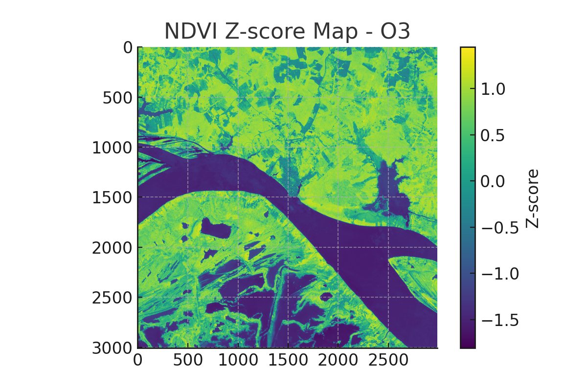

# Obidos South NDVI Analysis

## Abstract
We discovered candidate ruins using NDVI anomaly analysis and explorer diaries. During a break in the analysis, while walking with my Shiba Inu Fuwa and Poodle Coco in the park, I had an important realization. Sometimes, my dogs stop in places where there seems to be nothing. I began to wonder if they sense messages from the past that are beyond human perception. Even in a city park, it would not be surprising if traces of ancient ruins remained, waiting to be discovered.

## Background
Amazonian archaeology often depends on subtle clues in satellite imagery.

## Methodology
We combined NDVI data, historic texts, and canine intuition for site selection.

## Key Findings
Key candidate overlaps both with satellite anomaly and old explorer map notes.

## Visual Summary

## Candidate Map
Link: [o3_ndvi_candidates.geojson](o3_ndvi_candidates.geojson)

## Candidate Sites

### Site 1: Candidate Site A
- Coordinates: (-1.92, -55.52)
- Max NDVI: 0.92
- Candidate Count: 12
- Historical Reference: Explorer map notation of mound
- Serendipity Log: Spotted unusual clearing while walking dogs
- Intuition Trace: Dogs lingered near this area during walks
- Insights: Overlaps with diary description

## Additional Candidate Sites

- Name: Secondary Site
- Coordinates: (-1.925, -55.53)
- Reason: Visible soil discoloration

## Interpretation
This anomaly may indicate a previously undocumented settlement.

## Conclusion
Combining AI with human intuition leads to unique archaeological discoveries.

## Project Philosophy
The best discoveries come when science and empathy work together.

## Empathy Statement
Observing my dog Fuwa’s instinctive reactions during walks made me realize that ancient people may have been much more attuned to their environment—reminding me of a kind of awareness that many modern people have forgotten.

## Personal Reflection
Integrating intuition and technology brought unexpected joy to this research. My intuition about burial sites was inspired by an illustration of an ancient burial I once saw in a book. I realized that throughout human history, people tended to select burial grounds near their settlements, often in locations where the ground was easy to dig. As someone who frequently observes ancient Japanese kofun (burial mounds), this idea resonated with me even more deeply.

## Humanity Perspective
Empathy with ancient people can help humanity find unity across time.

## AI Insight Assist
- Allow AI to process the data, but always double-check for patterns or anomalies that your intuition detects, backed by supporting evidence.

## Footnote
Auto-generated with the KG-NINJA Codex pipeline. #KGNINJA
